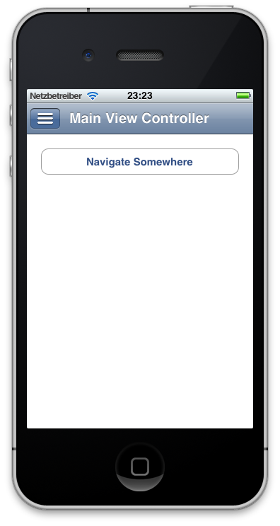
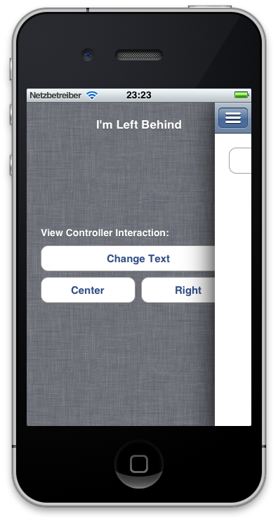
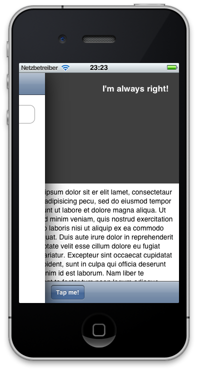

# MKDSlideViewController #

## About ##

*MKDSlideViewController* is a copy of the sliding view controller user interface found in the recently released **[Facebook]** App and in **[Path 2.0]**.

The Slide View Controller was tested with iOS 5.0 and relies on the built-in container view controller methods (see Documentation for UIViewController) in iOS 5.0.

*All files in this project can be freely used and modified under the [MIT] license*

## Disclaimer + Help Needed! ##

Help for conforming to the iOS 5 container view controller is welcomed.

Also these features are missing:

- MKDSlideViewControllerDelegate
- iPad support
- efficiency testing and optimizations

## Usage ##

See `ExampleProject` for a basic usage example.

## Screenshots ##

[Facebook]: https://www.facebook.com/iphone
[Path 2.0]: http://www.path.com/
[MIT]: http://www.opensource.org/licenses/mit-license.php
